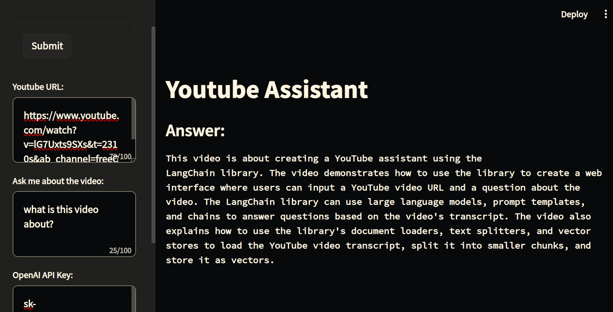

# Langchain YouTube Assistant
## How to run
```commandline
pip install -r requirements.txt
streamlit run main.py
```

## How to use
Enter a YouTube URL, a question related to it, and your openai api key. Then click the 'Submit' button to generate 
the answer. 


